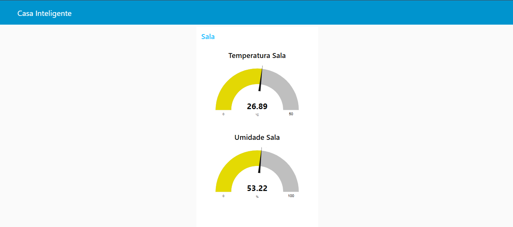
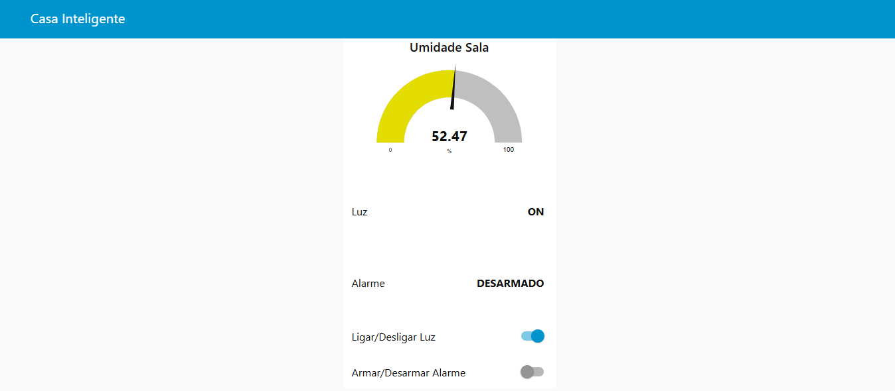
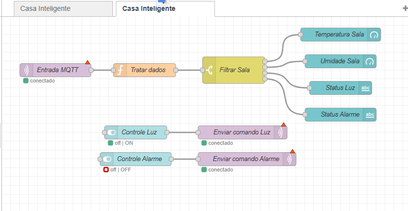
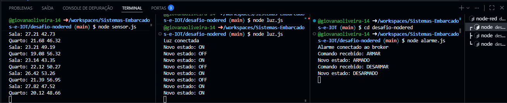

# Monitoramento de Ambiente Residencial Inteligente

## Descrição

Este projeto simula um sistema de **IoT para automação residencial**, utilizando o protocolo MQTT para comunicação entre dispositivos e o Node-RED para orquestração, visualização e controle.

A solução permite monitorar variáveis ambientais e controlar dispositivos remotamente, representando um cenário real de casa inteligente.

---

## Objetivo

* Consumir dados de múltiplos dispositivos via MQTT
* Processar e organizar informações em tempo real
* Exibir dados em um dashboard interativo
* Permitir controle remoto de atuadores (luz e alarme)

---

## Arquitetura do Sistema

```
Sensores (Node.js)
   ↓
MQTT Broker (Mosquitto - Docker)
   ↓
Node-RED (Dashboard + lógica)
   ↑
Atuadores (Luz e Alarme)
```

---

## Tópicos MQTT Utilizados

### 🔹 Sensores

* `casa/sala/temperatura`
* `casa/sala/umidade`
* `casa/quarto/temperatura`
* `casa/quarto/umidade`

### 💡 Luz

* `casa/sala/luz/comando`
* `casa/sala/luz/status`

### 🚨 Alarme

* `casa/alarme/comando`
* `casa/alarme/status`

---

## Tecnologias Utilizadas

* **Node.js** → simulação dos dispositivos (sensores e atuadores)
* **MQTT** → protocolo de comunicação leve
* **Mosquitto (Docker)** → broker MQTT
* **Node-RED** → orquestração e dashboard
* **Node-RED Dashboard** → interface visual

---

## ▶️ Como Executar o Projeto

### 🔹 1. Subir o broker MQTT (Docker)

```bash
docker-compose up -d
```

---

### 🔹 2. Iniciar o Node-RED

```bash
node-red
```

Acesse no navegador:

```
http://localhost:1880
```

---

### 🔹 3. Rodar os dispositivos

Em terminais separados:

```bash
node sensor.js
node luz.js
node alarme.js
```

---

### 🔹 4. Acessar o Dashboard

```
http://localhost:1880/ui
```

---

## 🖥️ Funcionalidades

✔ Monitoramento de temperatura (sala)

✔ Monitoramento de umidade (sala)

✔ Controle de luz (ligar/desligar)

✔ Controle de alarme (armar/desarmar)

✔ Atualização em tempo real via MQTT

---

### Dashboard




### Fluxo do Node-RED



### Terminal rodando sensores


---
