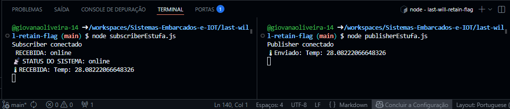
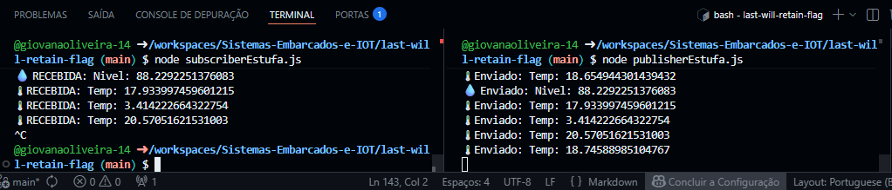
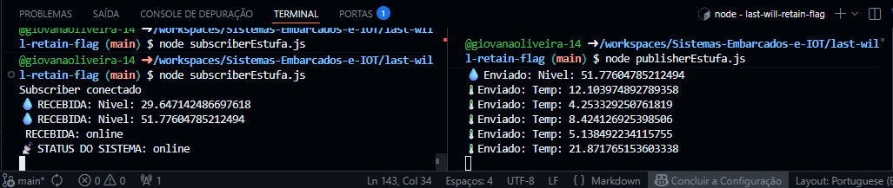
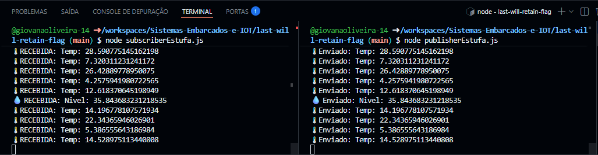
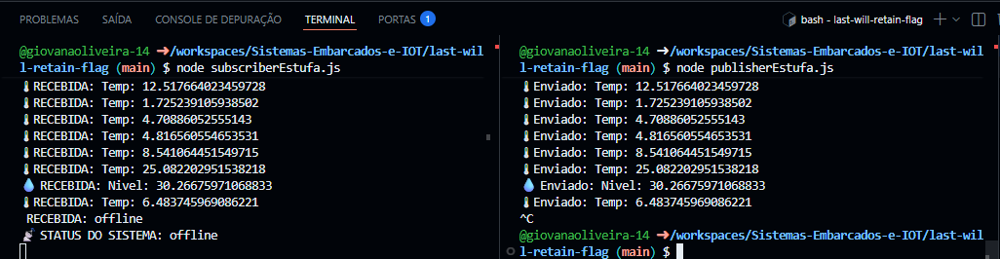
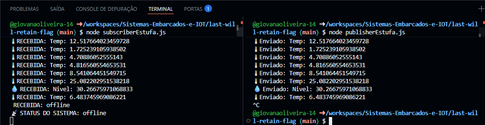
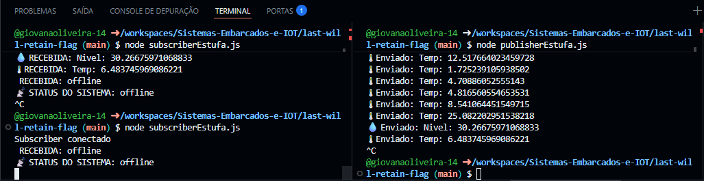

# Last Will Retain Flag

No protocolo MQTT, existem mecanismos que ajudam a garantir a confiabilidade da comunicação entre dispositivos. Um desses mecanismos é o uso do **Last Will and Testament (LWT)** combinado com a **flag de retenção (retain)**.

##  O que é Last Will (LWT)?

O Last Will funciona como um “aviso automático”.
Se o dispositivo cair inesperadamente, o broker envia uma mensagem avisando que ele ficou offline.

### Exemplo:

Um sensor pode definir que, se cair, o broker envie:

```
sensor/status → "offline"
```

---

##  O que é Retain Flag?

A flag `retain` indica que o broker deve armazenar a última mensagem publicada em um tópico.
Assim, qualquer novo cliente que se inscrever nesse tópico receberá imediatamente essa última mensagem.

---

##  O que é Last Will Retain Flag?

É a combinação dos dois conceitos:

* O cliente define uma mensagem de *Last Will*
* Essa mensagem é marcada com `retain: true`

### Resultado:

* Se o cliente cair inesperadamente:

  * O broker publica a mensagem automaticamente
  * E ainda armazena essa mensagem como o último estado do tópico

---

##  Exemplo Prático

Quando o cliente conecta:

```
sensor/status → "online" (retain: true)
```

Se o cliente cair inesperadamente:

```
sensor/status → "offline" (retain: true)
```

### Comportamento:

* Clientes já conectados recebem "offline"
* Novos clientes também recebem "offline" ao se inscrever

---

##  Quando usar cada um?

###  Last Will (LWT)

Quando você precisa detectar falhas inesperadas.

**Exemplos:**

* Sensores que podem perder conexão
* Dispositivos em campo (IoT)
* Monitoramento de status (online/offline)

---

###  Retain Flag

Quando é importante saber o **último estado** de um tópico.

**Exemplos:**

* Status de dispositivos (online/offline)
* Última leitura de sensor
* Configurações atuais do sistema

---

###  Last Will + Retain

Quando você quer garantir que o estado do dispositivo seja sempre conhecido, mesmo após falhas.

**Exemplos:**

* Sistemas críticos (segurança, indústria)
* Monitoramento remoto
* Automação residencial e agrícola

---

##  Impacto em Sistemas IoT Reais

Em sistemas IoT reais, essa combinação traz vários benefícios:

 * Detecção rápida de falhas: Se um dispositivo cair, o sistema é informado automaticamente.
 * Estado sempre atualizado: Mesmo novos dispositivos ou dashboards conseguem saber imediatamente se um sensor está online ou offline.
 * Maior confiabilidade: Evita decisões baseadas em dados desatualizados (ex: achar que um sensor está funcionando quando não está).

---

###  Sem isso, podem ocorrer problemas:

* Dispositivos “fantasmas” (parecem online, mas não estão)
* Falta de informação em dashboards
* Erros em automações (ex: irrigação baseada em sensor offline)

---

## Escolha dos QoS

Cada tipo de dado possui um nível de criticidade diferente:

- 🌡 Temperatura (QoS 0)
  - Dados frequentes e não críticos
  - Perder uma leitura não afeta o sistema

- 💧 Nível de água (QoS 1)
  - Informação importante
  - Pode ser reenviada, mesmo com duplicação

- 🔥 Incêndio (QoS 2)
  - Evento crítico
  - Não pode ser perdido nem duplicado

---

## Como rodar o projeto

 * Subir o broker MQTT: No terminal, rode o comando:
 ```
 docker-compose up -d
 ```
 * Após isso, abra o terminal e rode:
 ```
 node subscriberEstufa.js // Saída esperada: Subscriber conectado
 ```
 * Abra outro terminal e rode:
 ```
 node publisherEstufa.js // Saída esperada: Publisher conectado 🌡 Enviado: ...
 ```
 
---

## Testes Realizados

### Teste 1 - Retain

 * Deixei o projeto executando:


 * Parei o subscriber:


 * Ativei novamente o subscriber:



**Conclusão**: O retain está funcionando, pois ele recebeu algo que foi enviado no passado.

### Teste 2 - Last Will

 * Deixei o projeto em execução:


 * Encerrei o publisher:



**Conclusão**: O Last Will está funcionando, o broker enviou a mensagem sozinho quando o publisher foi encerrado, informando que o sensor estava offline

### Teste 3 - Retain após falha

 * Permaneci com o publisher encerrado:


 * Reiniciei o subscriber:



**Conclusão**: O Last Will e retain estão funcionando juntos 